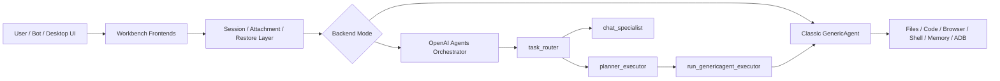

# GenericAgent Workbench 中文说明

<p align="center">
  <strong>基于 GenericAgent 的实用型桌面 Agent 工作台。</strong><br/>
  经典 GenericAgent 执行内核 + 多智能体编排 + Streamlit UI + 附件上下文 + 历史恢复 + 记忆工作流。
</p>

<p align="center">
  <a href="https://github.com/lsdefine/GenericAgent">上游 GenericAgent</a> |
  <a href="#quick-start">快速开始</a> |
  <a href="#first-time-usage">第一次使用</a> |
  <a href="#backend-modes">后端模式</a> |
  <a href="#architecture">架构说明</a> |
  <a href="#troubleshooting">常见问题</a>
</p>

<p align="center">
  
  
  
  
</p>

> [!IMPORTANT]
> 这不是 GenericAgent 的官方下一代版本。
> 这是一个基于 GenericAgent 的下游工作台分支，重点解决实际桌面使用、国内可访问模型接入、会话恢复、附件上下文和多智能体编排问题。

---

## 这是什么？

**GenericAgent Workbench** 是基于 [GenericAgent](https://github.com/lsdefine/GenericAgent) 的下游工作台分支。

上游项目提供的是一个极简、自演化、具备真实执行能力的 Agent runtime。本项目保留经典 GenericAgent 作为底层执行内核，并在外层增加一套更接近日常产品使用的工作台能力：

* 桌面版 Streamlit UI
* 经典 GenericAgent / OpenAI Agents 双后端
* 规则快速路由
* 多智能体编排
* 文本 / PDF / DOCX 附件上下文
* 结构化历史恢复
* 会话提炼与记忆候选池
* Bot、调度器、桌面窗口等入口

一句话概括：

> **GenericAgent 是执行内核，GenericAgent Workbench 是围绕它搭建的个人 Agent 工作台。**

---

## 演示

> 截图 / GIF 占位。
> 建议在这里放一张 Streamlit 工作台截图，重点展示左侧的 History、Memory、Attachments 和后端状态。

```text
UI / Bot / Desktop Window
        ↓
Session + Attachment + Restore Layer
        ↓
Routing + Orchestration Layer
        ↓
Classic GenericAgent Executor
        ↓
Files / Code / Browser / Shell / Memory
```

---

## 它能做什么？

你可以把 GenericAgent Workbench 当作一个本地个人 Agent 工作台。

它可以：

* 对普通轻量问题直接回答，不必进入重型执行路径
* 把文件 / 代码 / 浏览器 / shell 等任务委托给经典 GenericAgent 执行器
* 上传 `.txt`、`.md`、`.py`、`.json`、`.csv`、`.pdf`、`.docx` 等文件作为任务上下文
* 从历史会话中恢复上下文并继续任务
* 把有价值的历史对话提炼到记忆候选池
* 在经典 GenericAgent 后端与 OpenAI Agents 编排后端之间切换
* 通过 `pywebview` 以桌面窗口方式运行
* 可选启动 Bot 前端和调度工作流

示例任务：

```text
解释这个仓库是做什么的。
```

```text
阅读我上传的 PDF，并总结里面的实现方案。
```

```text
检查当前项目文件，告诉我 README 应该怎么改。
```

```text
运行测试脚本，并帮我分析报错原因。
```

---

## 适合谁使用？

如果你需要以下能力，适合使用本仓库：

* 继续使用 GenericAgent 的真实本地执行能力
* 需要更适合日常使用的桌面工作台界面
* 需要更好的历史恢复和长任务支持
* 需要上传文档作为任务上下文
* 需要把路由、规划、执行和 UI 分层
* 需要更灵活地接入 OpenAI-compatible / Claude-compatible 模型

如果你更看重以下目标，更适合直接使用上游 GenericAgent：

* 最小化 runtime
* 最贴近上游原始设计
* 更少产品层代码
* 更容易跟随上游主线更新

---

<a id="quick-start"></a>

## 快速开始

### 1. 克隆仓库

```bash
git clone https://github.com/user141514/GenericAgent-Workbench.git
cd GenericAgent-Workbench
```

### 2. 创建 Python 环境

Windows 推荐使用 Conda：

```bash
conda create -n rag-env python=3.11 -y
conda activate rag-env
```

启动器会优先尝试使用 `rag-env` 这个 Conda 环境。

### 3. 安装依赖

核心依赖：

```bash
pip install streamlit pywebview requests qrcode pycryptodome lark-oapi
```

如果需要 PDF / DOCX 附件上传能力：

```bash
pip install pymupdf python-docx
```

如果仓库后续提供了 `requirements.txt`，也可以使用：

```bash
pip install -r requirements.txt
```

### 4. 配置模型

复制模板：

```powershell
copy mykey_template.py mykey.py
```

macOS / Linux：

```bash
cp mykey_template.py mykey.py
```

然后编辑 `mykey.py`，填写你的模型服务配置。

### 5. 启动工作台

经典 GenericAgent 后端：

```bash
python launch.pyw
```

OpenAI Agents 编排后端：

```bash
python start_test.pyw
```

也可以手动选择后端：

```powershell
$env:GA_AGENT_BACKEND = "openai-agents"
python launch.pyw
```

### 6. 启动带调度器的版本

```bash
python launch.pyw --sched
```

---

## 模型配置

GenericAgent Workbench 会尝试从以下位置读取模型配置：

1. `mykey.py`
2. `mykey.json`
3. `~/.claude/settings.json`
4. 环境变量中的 `OPENAI_*` 和 `ANTHROPIC_*`

### 示例：OpenAI-compatible 服务

```python
mykeys = {
    "openai_compatible": {
        "apikey": "YOUR_API_KEY",
        "apibase": "https://your-openai-compatible-endpoint.com/v1",
        "model": "gpt-4o-mini",
        "stream": True,
        "connect_timeout": 30,
        "read_timeout": 300,
    }
}
```

如果使用国内可访问的 OpenAI-compatible 服务，把 `apibase` 设置为服务商提供的 `/v1` 地址。

### 示例：Claude / Anthropic-compatible 服务

```python
mykeys = {
    "claude": {
        "apikey": "YOUR_ANTHROPIC_KEY",
        "apibase": "https://api.anthropic.com",
        "model": "claude-3-5-sonnet-latest",
        "stream": True,
        "connect_timeout": 30,
        "read_timeout": 300,
    }
}
```

> 具体字段名请以当前仓库中的 `mykey_template.py` 为准。

---

<a id="first-time-usage"></a>

## 第一次使用

启动后，项目会打开一个本地 Streamlit 工作台，通常会被包在 `pywebview` 桌面窗口中。

### 主聊天区

主聊天输入框可以像普通助手一样使用。

系统会根据路由判断当前请求应该走轻量聊天路径，还是进入更重的执行路径。

轻量问题示例：

```text
ReAct 和 Plan-and-Execute agent 有什么区别？
```

执行型任务示例：

```text
阅读当前仓库，找到 Streamlit UI 是在哪里实现的。
```

```text
运行测试脚本，并总结错误原因。
```

### 侧边栏

侧边栏是工作台的主要控制区。

#### History / 历史

用于：

* 查看最近的对话日志
* 预览历史会话
* 恢复之前的对话上下文
* 把会话提炼成记忆候选
* 在保存有价值记忆后删除旧历史

#### Memory / 记忆

用于查看：

* `global_mem_insight.txt`
* `global_mem.txt`
* `history_memory_inbox.md`

记忆候选池用于保存人工确认后的会话提炼结果，适合把长对话变成后续可复用的知识。

#### Attachments / 附件

用于上传当前任务的上下文文件。

支持类型包括：

* 文本类文件：`.txt`、`.md`、`.py`、`.json`、`.csv`、`.yaml`、`.log`、`.sql`、`.js`、`.ts`、`.html`、`.css`、`.xml`
* `.pdf`
* `.docx`

工作台会自动抽取文本、生成预览、压缩长文，并把压缩后的上下文注入到当前 prompt 中。

#### Stop task / 停止任务

当当前 agent 执行太久、方向错误或已经不需要继续时，可以点击停止。

#### Switch LLM / 切换模型

用于在已配置的多个模型后端之间切换。

#### Reinject tools / 重新注入工具

当模型工具调用不稳定、忘记可用工具或持续误用工具时，可以重新注入工具示例。

---

<a id="backend-modes"></a>

## 后端模式

GenericAgent Workbench 支持两种主要后端模式。

### 1. 经典 GenericAgent 后端

启动：

```bash
python launch.pyw
```

适合：

* 使用原始 GenericAgent 行为
* 本地文件操作
* 代码执行
* 浏览器 / shell 任务
* 学习上游 runtime 设计

这个模式尽量保留经典 GenericAgent 的执行路径。

### 2. OpenAI Agents 编排后端

启动：

```bash
python start_test.pyw
```

适合：

* 同时处理轻量聊天和复杂执行任务
* 拆分路由、聊天、规划和执行职责
* 实验 task router / planner-executor 流程
* 只有在需要真实执行时，才把任务委托给经典 GenericAgent

编排后端包含：

* `task_router`
* `chat_specialist`
* `planner_executor`
* `run_genericagent_executor`

简单问题可以由 chat specialist 直接处理。复杂任务会进入 planner/executor 路径，并最终委托给经典 GenericAgent runtime 执行。

---

<a id="architecture"></a>

## 架构说明

GenericAgent Workbench 采用分层设计。



### 轻量问题执行流

```text
user
  -> workbench UI
  -> task_router
  -> chat_specialist
  -> final answer
```

### 复杂任务执行流

```text
user
  -> workbench UI
  -> task_router
  -> planner_executor
  -> run_genericagent_executor
  -> classic GenericAgent executor
  -> tool results
  -> final answer
```

---

## 项目结构

```text
GenericAgent-Workbench/
├─ core/                      # 核心运行时与编排逻辑
│  ├─ agentmain.py            # 经典 GenericAgent 后端
│  ├─ openai_agentmain.py     # OpenAI Agents 编排后端
│  ├─ router_rules.py         # 规则快速路由层
│  ├─ llmcore.py              # 模型会话与供应商适配
│  └─ runtime_env.py          # Conda 运行时选择
├─ frontends/
│  ├─ stapp.py                # 主 Streamlit 工作台
│  ├─ chatapp_common.py       # 恢复、提炼、公共聊天逻辑
│  ├─ file_processor.py       # 附件抽取与压缩
│  ├─ tgapp.py                # Telegram 前端
│  ├─ fsapp.py                # Feishu 前端
│  ├─ wecomapp.py             # 企业微信前端
│  ├─ dingtalkapp.py          # 钉钉前端
│  ├─ wechatapp.py            # 微信个人号前端
│  └─ ...
├─ memory/
│  ├─ global_mem.txt
│  ├─ global_mem_insight.txt
│  ├─ history_memory_inbox.md
│  └─ L4_raw_sessions/
├─ reflect/
│  └─ scheduler.py            # 调度与会话归档触发
├─ launch.pyw                 # 默认桌面启动器
├─ start_test.pyw             # OpenAI Agents 后端启动器
└─ mykey_template.py           # 模型配置模板
```

---

## 和上游 GenericAgent 的关系

本仓库不是为了替代上游 GenericAgent。

可以这样理解：

| 层级                     | 作用        |
| ---------------------- | --------- |
| 上游 GenericAgent        | 极简执行内核    |
| GenericAgent Workbench | 下游产品化工作台层 |

### 保留上游能力

* 真实本地执行
* 文件 / 代码 / 浏览器 / shell 工具调用
* 记忆导向的 agent 工作流
* 经典 GenericAgent runtime 作为执行器

### 本分支新增能力

* 桌面工作台 UI
* 双后端切换
* 多智能体编排
* 规则路由
* 附件上下文注入
* 结构化历史恢复
* 记忆候选池工作流
* 更适合本地使用的启动器

### 为什么不把所有东西都合回上游？

上游项目更偏向小核心和聚焦补丁。本仓库的很多改动属于产品层、工作台层和本地使用增强，因此更适合保留在下游分支中独立演进。

---

## 安全说明

这个项目可以把任务委托给真实的本地执行器，请谨慎使用。

* 不要随意上传 `.env`、私钥、credential、password、token 等敏感文件。
* 尽量在独立项目目录中运行。
* 涉及 shell、文件修改、浏览器自动化和自主任务时，建议人工确认。
* 附件管线会对可疑文件名做提示，但不能保证完整识别所有密钥内容。
* 当前版本是实验性本地工作台，不是生产级安全沙箱。

---

<a id="troubleshooting"></a>

## 常见问题

### 找不到 `mykey.py`

先复制模板：

```powershell
copy mykey_template.py mykey.py
```

然后填写 API key、base URL 和模型名。

### Streamlit 没有打开

可以尝试手动运行前端：

```bash
streamlit run frontends/stapp.py
```

### Python 环境不对

启动器会优先使用 `rag-env` Conda 环境。

检查环境：

```bash
conda env list
where python
```

macOS / Linux：

```bash
which python
```

### 附件解析失败

安装可选依赖：

```bash
pip install pymupdf python-docx
```

### Agent 持续误用工具

可以尝试：

1. 在侧边栏点击 **重新注入工具**
2. 切换到另一个已配置模型
3. 重启工作台
4. 缩小任务范围后重试

### 任务运行太久

点击侧边栏中的 **停止任务**，或者直接重启工作台。

### OpenAI-compatible 接口失败

检查：

* `apibase` 是否以 `/v1` 结尾
* 模型名是否是服务商支持的模型
* 服务商是否支持 streaming
* 服务商是否支持 tool calling
* 本地代理或网络设置是否干扰请求

---

## Roadmap

当前重点：

* 稳定经典后端 / OpenAI Agents 后端切换
* 改善模型服务兼容性
* 提高历史恢复可靠性
* 让附件上下文更安全、更可预测
* 补充常见使用路径文档

可能的后续方向：

* 增加截图和 Demo GIF
* 补齐完整 `requirements.txt`
* 增加独立中文 README
* 把附件处理从直接 prompt 注入升级为 RAG 检索
* 增加 MCP 风格工具集成
* 对 router rules 做可评估的命中率优化
* 对高风险操作增加确认机制

---

## FAQ

### 这是 GenericAgent 的官方下一代版本吗？

不是。这是一个围绕 GenericAgent 构建的下游工作台分支。

### 为什么名字里还保留 GenericAgent？

因为最核心的真实执行能力仍然来自经典 GenericAgent runtime。本仓库主要是在外层增加工作台能力。

### 我应该用上游 GenericAgent，还是这个分支？

如果你想学习或使用最小原始 runtime，用上游 GenericAgent。
如果你想要桌面工作台、附件、历史恢复、编排层和更实用的本地使用体验，用本分支。

### 这个项目适合生产环境吗？

不适合。当前版本是实验性项目，更适合本地个人使用、研究和工作流探索。

### 附件上传就是 RAG 吗？

不是。当前附件管线是抽取文本、压缩内容，然后把压缩后的上下文注入当前 prompt。完整 RAG 还需要索引、检索、重排和带引用的回答生成。

---

## 当前一句话定位

> **GenericAgent Workbench = GenericAgent 执行内核 + 多智能体编排层 + 桌面工作台 UI + 附件上下文 + 历史恢复 + 记忆工作流。**
