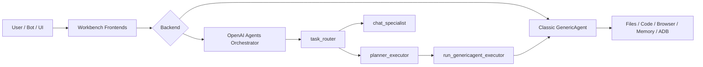

# GenericAgent Workbench

<p align="center">
  <strong>A multi-agent workbench built on top of GenericAgent.</strong><br/>
  Keep the classic GenericAgent executor, and add orchestration, UI, attachments, restore, and memory workflows.
</p>

<p align="center">
  <a href="https://github.com/lsdefine/GenericAgent">Upstream GenericAgent</a> |
  <a href="#positioning">项目定位</a> |
  <a href="#upgrades">核心升级</a> |
  <a href="#quick-start">快速开始</a> |
  <a href="#comparison">对比上游</a>
</p>

<p align="center">
  
  
  
  
</p>

> [!IMPORTANT]
> 这个仓库的核心定位不是“替代上游 GenericAgent”，而是“以 GenericAgent 为执行内核做出来的工作台层”。

> [!NOTE]
> 仓库目录当前仍然叫 `GAgent-Multi`，但面对外部介绍时，更推荐使用产品名 `GenericAgent Workbench`。

## TL;DR

如果把上游 [GenericAgent](https://github.com/lsdefine/GenericAgent) 看成一个极简、自演化、真实可执行的 Agent 内核，那么这个仓库就是围绕它搭出来的一个更适合日常使用的工作台：

- 保留经典 GenericAgent 作为“强执行器”
- 新增 OpenAI Agents 多智能体编排层
- 增强 Streamlit 聊天式 UI
- 支持文本 / PDF / DOCX 附件注入
- 支持结构化历史恢复、摘要提炼、记忆候选池
- 支持桌面窗口、Bot 前端、调度与归档工作流

一句话概括：

> **GenericAgent 是内核，GenericAgent Workbench 是工作台。**

<a id="positioning"></a>
## 项目定位

### 这个项目是什么

`GenericAgent Workbench` 是一个以 `GenericAgent` 为执行底座的多智能体工作台。  
它不是只做“聊天”，也不是重新发明一套执行器，而是在上游内核之外补齐更像产品的那一层：

- 路由
- 编排
- UI
- 会话管理
- 附件处理
- 历史恢复
- 调度与记忆操作

### 这个项目不是什么

- 不是上游主线仓库的逐行同步镜像
- 不是“官方下一代 GenericAgent”
- 不是把经典 GenericAgent 丢掉后另起炉灶

### 名字为什么继续和 GenericAgent 挂钩

因为这个仓库最重要的事实没有变：

1. 真正的文件 / 代码 / 浏览器 / 工具执行，仍然依赖经典 GenericAgent
2. 新增的大部分内容，本质上是围绕这个执行内核做的工作台包装
3. 因此名字里保留 `GenericAgent`，能直接说明血缘关系和核心能力来源

<a id="upgrades"></a>
## 核心升级

### 升级摘要

- [x] 双后端：经典 GenericAgent + OpenAI Agents 编排后端
- [x] 多智能体分工：`task_router / chat_specialist / planner_executor`
- [x] 规则快速路由层
- [x] 聊天式 Streamlit 工作台 UI
- [x] 文本 / PDF / DOCX 附件处理
- [x] 结构化 `INPUT_ITEMS` 历史恢复
- [x] 历史提炼、记忆候选池、L4 会话归档
- [x] 桌面窗口 + Telegram / Feishu / 企业微信 / 钉钉 / 微信等前端入口

### 1. OpenAI Agents 多智能体编排层

新增 [`core/openai_agentmain.py`](./core/openai_agentmain.py)。

它不是另一个“自己全做”的执行器，而是一个 orchestration layer：

- `task_router`：只负责分流，不直接执行
- `chat_specialist`：处理解释型、纯对话型请求
- `planner_executor`：负责复杂任务的规划、委派、验证
- `run_genericagent_executor`：把真实执行委托给经典 GenericAgent

这套结构的价值是：

- 简单聊天不必进入重型执行路径
- 复杂任务仍然复用上游真实工具链
- 编排层和执行层职责更清晰

### 2. 规则路由层

新增 [`core/router_rules.py`](./core/router_rules.py)。

在 LLM 路由前先做一层轻量规则判断：

- 简单问答优先去 `chat_specialist`
- 文件 / 代码 / 浏览器 / shell / 多步骤任务优先去 `planner_executor`
- 未命中规则时，再交给模型做最终判断

这让系统在“聊天”和“执行”之间切换时更稳，也更省。

### 3. 工作台式 Streamlit UI

主界面在 [`frontends/stapp.py`](./frontends/stapp.py)。

它已经不是一个只有输入框的 demo，而是一个工作台：

- 历史对话列表与预览
- 一键恢复历史上下文
- 历史摘要提炼
- 记忆面板查看 `L1 / L2 / Inbox`
- 附件上传面板
- 助手历史回复压缩 / 展开
- 兼容 `genericagent` 与 `openai-agents`

### 4. 附件处理管线

新增 [`frontends/file_processor.py`](./frontends/file_processor.py)。

支持：

- 文本类文件
- PDF
- DOCX

它会自动完成：

- 抽取正文
- 生成预览
- 压缩长文为 distilled text
- 敏感文件名预警
- 把附件摘要拼进 prompt

所以这个工作台不是“只能聊天”，而是“能带文档上下文工作”。

### 5. 结构化历史恢复

相关逻辑在：

- [`frontends/chatapp_common.py`](./frontends/chatapp_common.py)
- [`core/openai_agentmain.py`](./core/openai_agentmain.py)

除了传统文本日志恢复，这个分支还支持：

- 为 `openai-agents` 后端写入结构化 `INPUT_ITEMS`
- 从结构化历史中恢复真实 `user / assistant` 消息
- 避免把工具结果误恢复成用户消息
- 在 UI 与部分 Bot 前端里复用同一套恢复逻辑

### 6. 桌面工作流与调度

入口包括：

- [`launch.pyw`](./launch.pyw)：默认桌面启动器
- [`start_test.pyw`](./start_test.pyw)：直接启动 `openai-agents` 后端
- [`core/runtime_env.py`](./core/runtime_env.py)：优先选择 `rag-env` Conda 环境
- [`reflect/scheduler.py`](./reflect/scheduler.py)：调度与归档触发

因此这个仓库更接近“持续运行的桌面 Agent 工作台”，而不是一次性脚本集合。

---

## 架构概览



### 执行逻辑

```text
simple question
  -> task_router
  -> chat_specialist
  -> direct answer

complex task
  -> task_router
  -> planner_executor
  -> run_genericagent_executor
  -> classic GenericAgent
  -> result verification
```

<a id="comparison"></a>
## 与上游 GenericAgent 的对比

| 维度 | 上游 GenericAgent | GenericAgent Workbench |
|---|---|---|
| 核心定位 | 极简、自演化 Agent 内核 | 围绕内核构建的交互工作台 |
| 主要卖点 | 最小核心、真实执行、自演化 skill | 编排层、工作台 UI、附件、恢复、记忆工作流 |
| 执行架构 | 经典单体执行循环 | 多智能体编排 + 经典执行器下沉 |
| 后端模式 | 经典后端 | 双后端可切换 |
| 路由方式 | 主要依赖主模型 | 规则快速路由 + agent handoff |
| UI 形态 | 原生前端 / demo 风格 | 聊天式 Streamlit workbench |
| 会话恢复 | 传统文本日志恢复 | 结构化 `INPUT_ITEMS` 恢复 |
| 文件上下文 | 以任务输入为主 | 文本 / PDF / DOCX 附件注入 |
| 适合人群 | 研究原始设计、喜欢极简 runtime | 想直接把 Agent 当工作台使用 |

### 什么时候更适合用上游

如果你更在意：

- 最小代码量
- 主线能力同步
- 原教旨式 GenericAgent 设计

那更适合直接使用上游仓库：  
[https://github.com/lsdefine/GenericAgent](https://github.com/lsdefine/GenericAgent)

### 什么时候更适合用这个仓库

如果你更在意：

- 更强的日常交互体验
- 更清晰的 agent 分工
- 更好用的历史恢复
- 文档附件上下文
- 更像产品而不是 demo 的桌面入口

那这个工作台分支会更顺手。

---

## 目录说明

```text
GAgent-Multi/
├─ core/                      # 核心运行时与编排逻辑
│  ├─ openai_agentmain.py     # OpenAI Agents 多智能体编排后端
│  ├─ agentmain.py            # 经典 GenericAgent 后端
│  ├─ router_rules.py         # 规则快速路由层
│  ├─ llmcore.py              # 模型会话与供应商适配
│  └─ runtime_env.py          # Conda 运行时选择
├─ launch.pyw                 # 默认桌面启动器
├─ start_test.pyw             # openai-agents 启动器
├─ frontends/
│  ├─ stapp.py                # 主 Streamlit 工作台
│  ├─ chatapp_common.py       # 恢复、提炼、公共聊天逻辑
│  ├─ file_processor.py       # 附件抽取与压缩
│  ├─ tgapp.py                # Telegram 前端
│  ├─ fsapp.py                # Feishu 前端
│  ├─ wecomapp.py             # 企业微信前端
│  ├─ dingtalkapp.py          # 钉钉前端
│  ├─ wechatapp.py            # 微信个人号前端
│  └─ ...
├─ memory/
│  ├─ global_mem.txt
│  ├─ global_mem_insight.txt
│  ├─ history_memory_inbox.md
│  └─ L4_raw_sessions/
└─ reflect/
   └─ scheduler.py            # 调度与会话归档
```

<a id="quick-start"></a>
## 快速开始

### 环境建议

- Windows 桌面环境
- Python 3.11+
- 推荐 Conda 环境：`rag-env`

### 1. 安装依赖

最常用的一组依赖：

```bash
pip install streamlit pywebview requests qrcode pycryptodome lark-oapi
```

如果你要启用附件上传（PDF / DOCX）：

```bash
pip install pymupdf python-docx
```

### 2. 配置模型

复制模板：

```bash
copy mykey_template.py mykey.py
```

然后填写你的模型配置。

当前多智能体后端会优先尝试从这些位置读取配置：

1. `mykey.py`
2. `mykey.json`
3. `~/.claude/settings.json`
4. 环境变量中的 `OPENAI_*` / `ANTHROPIC_*`

### 3. 启动经典后端

```bash
python launch.pyw
```

### 4. 启动 OpenAI Agents 后端

推荐直接使用：

```bash
python start_test.pyw
```

或者手动切换：

```powershell
$env:GA_AGENT_BACKEND = "openai-agents"
python launch.pyw
```

### 5. 启动带调度器的桌面版本

```bash
python launch.pyw --sched
```

---

## 常用入口

| 入口 | 用途 |
|---|---|
| `python launch.pyw` | 默认桌面工作台 |
| `python start_test.pyw` | OpenAI Agents 编排后端测试入口 |
| `python frontends/tgapp.py` | Telegram 前端 |
| `python frontends/fsapp.py` | Feishu 前端 |
| `python frontends/wecomapp.py` | 企业微信前端 |
| `python frontends/dingtalkapp.py` | 钉钉前端 |
| `python frontends/wechatapp.py` | 微信个人号前端 |

---

## 适合谁

### 用这个仓库，如果你想要

- 继续吃到 GenericAgent 的真实执行能力
- 但又不想只停留在一个极简 runtime
- 想要更好的交互层和工作台体验
- 想尝试“编排层 + 执行层”拆分架构

### 用上游仓库，如果你想要

- 最小、最直接的 GenericAgent 内核体验
- 更强的主线一致性
- 更聚焦于自演化 runtime 本身

---

## FAQ

<details>
<summary><strong>Q1. 这是不是 GenericAgent 的官方主线升级版？</strong></summary>

不是。  
更准确地说，这是一个以 GenericAgent 为执行底座的工程化工作台分支。

</details>

<details>
<summary><strong>Q2. 为什么名字里还保留 GenericAgent？</strong></summary>

因为最核心的执行能力仍然来自经典 GenericAgent。  
这个仓库新增的主要是编排层、交互层、恢复与工作流层。

</details>

<details>
<summary><strong>Q3. 这个仓库和上游是什么关系？</strong></summary>

可以理解为：

- 上游：Agent 内核
- 这个仓库：围绕内核做出来的工作台

</details>

<details>
<summary><strong>Q4. 这个仓库未来最像什么？</strong></summary>

更像一个“个人 Agent Workbench”，而不是单纯的聊天界面或一次性脚本集合。

</details>

---

## 当前一句话定位

> **GenericAgent Workbench = GenericAgent execution core + orchestration layer + workbench UI + memory and restore workflows.**
