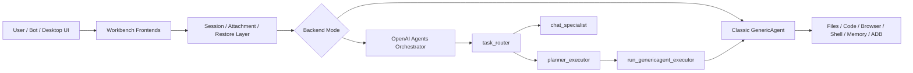

# GenericAgent Workbench

<p align="center">
  <strong>A practical desktop workbench built on top of GenericAgent.</strong><br/>
  Classic GenericAgent execution core + orchestration + Streamlit UI + attachments + session restore + memory workflows.
</p>

<p align="center">
  <a href="https://github.com/lsdefine/GenericAgent">Upstream GenericAgent</a> |
  <a href="#quick-start">Quick Start</a> |
  <a href="#first-time-usage">First-time Usage</a> |
  <a href="#backend-modes">Backend Modes</a> |
  <a href="#architecture">Architecture</a> |
  <a href="#troubleshooting">Troubleshooting</a>
</p>

<p align="center">
  
  
  
  
</p>

> [!IMPORTANT]
> This is not the official next version of GenericAgent.
> It is a downstream workbench fork focused on practical desktop usage, China-accessible model compatibility, session restoration, attachments, and multi-agent orchestration.

---

## What is this?

**GenericAgent Workbench** is a downstream workbench fork of [GenericAgent](https://github.com/lsdefine/GenericAgent).

The upstream project provides a minimal, self-evolving, real-execution agent runtime. This project keeps the classic GenericAgent executor as the lower-level execution core, then adds a product-like workbench layer around it:

* desktop Streamlit UI
* classic GenericAgent / OpenAI Agents dual backend
* rule-based fast routing
* multi-agent orchestration
* text / PDF / DOCX attachment context
* structured session restore
* conversation distillation and memory inbox
* bot, scheduler, and desktop window entrypoints

In one sentence:

> **GenericAgent is the execution kernel. GenericAgent Workbench is the daily-use workbench around it.**

---

## Demo

> Screenshot / GIF placeholder.
> Add a screenshot of the Streamlit workbench here, especially the sidebar with History, Memory, Attachments, and backend status.

```text
UI / Bot / Desktop Window
        ↓
Session + Attachment + Restore Layer
        ↓
Routing + Orchestration Layer
        ↓
Classic GenericAgent Executor
        ↓
Files / Code / Browser / Shell / Memory
```

---

## What can it do?

You can use GenericAgent Workbench as a local personal agent workbench.

It can:

* answer lightweight questions without entering the heavy executor path
* delegate file / code / browser / shell tasks to the classic GenericAgent executor
* upload `.txt`, `.md`, `.py`, `.json`, `.csv`, `.pdf`, and `.docx` files as task context
* restore previous conversations and continue from structured history
* distill useful conversation history into a memory inbox
* switch between the classic backend and the OpenAI Agents orchestration backend
* run as a desktop window through `pywebview`
* optionally start bot frontends and scheduled workflows

Example tasks:

```text
Explain what this repository does.
```

```text
Read the uploaded PDF and summarize the implementation plan.
```

```text
Check the current project files and suggest how to improve the README.
```

```text
Run the test script and help me debug the failure.
```

---

## Who is this for?

Use this repository if you want:

* the real execution ability of GenericAgent
* a more usable desktop-style interface
* better session recovery and long-running workflow support
* attachment-based document context
* a cleaner separation between routing, planning, execution, and UI
* practical OpenAI-compatible / Claude-compatible model configuration for local usage

Use upstream GenericAgent directly if you want:

* the smallest possible runtime
* the most faithful upstream design
* less product-layer code
* easier tracking of upstream changes

---

## Quick Start

### 1. Clone

```bash
git clone https://github.com/user141514/GenericAgent-Workbench.git
cd GenericAgent-Workbench
```

### 2. Create a Python environment

Recommended on Windows:

```bash
conda create -n rag-env python=3.11 -y
conda activate rag-env
```

The launcher will try to use the `rag-env` Conda environment when available.

### 3. Install dependencies

Core dependencies:

```bash
pip install streamlit pywebview requests qrcode pycryptodome lark-oapi
```

Optional dependencies for PDF / DOCX attachments:

```bash
pip install pymupdf python-docx
```

If this repository later provides a `requirements.txt`, you can use:

```bash
pip install -r requirements.txt
```

### 4. Configure your model

Copy the template:

```powershell
copy mykey_template.py mykey.py
```

On macOS / Linux:

```bash
cp mykey_template.py mykey.py
```

Then edit `mykey.py` and fill in your model provider configuration.

### 5. Launch the workbench

Classic GenericAgent backend:

```bash
python launch.pyw
```

OpenAI Agents orchestration backend:

```bash
python start_test.pyw
```

Or manually select the backend:

```powershell
$env:GA_AGENT_BACKEND = "openai-agents"
python launch.pyw
```

### 6. Launch with scheduler

```bash
python launch.pyw --sched
```

---

## Model Configuration

GenericAgent Workbench tries to load model configuration from these sources:

1. `mykey.py`
2. `mykey.json`
3. `~/.claude/settings.json`
4. environment variables such as `OPENAI_*` and `ANTHROPIC_*`

### Example: OpenAI-compatible provider

```python
mykeys = {
    "openai_compatible": {
        "apikey": "YOUR_API_KEY",
        "apibase": "https://your-openai-compatible-endpoint.com/v1",
        "model": "gpt-4o-mini",
        "stream": True,
        "connect_timeout": 30,
        "read_timeout": 300,
    }
}
```

For China-accessible OpenAI-compatible providers, set `apibase` to the provider's `/v1` endpoint.

### Example: Claude / Anthropic-compatible provider

```python
mykeys = {
    "claude": {
        "apikey": "YOUR_ANTHROPIC_KEY",
        "apibase": "https://api.anthropic.com",
        "model": "claude-3-5-sonnet-latest",
        "stream": True,
        "connect_timeout": 30,
        "read_timeout": 300,
    }
}
```

> The exact field names should follow the current `mykey_template.py` in this repository.

---

## First-time Usage

After launching, the project opens a local Streamlit workbench, usually inside a desktop `pywebview` window.

### Main chat

Use the main chat input like a normal assistant interface.

The router decides whether a request should go through a lightweight chat path or a heavier execution path.

Typical lightweight requests:

```text
What is the difference between ReAct and Plan-and-Execute agents?
```

Typical execution requests:

```text
Read the current repository and find where the Streamlit UI is implemented.
```

```text
Run the test script and summarize the error.
```

### Sidebar

The sidebar is the main workbench control panel.

#### History

Use **History** to:

* view recent conversation logs
* preview a previous session
* restore a previous conversation
* distill a conversation into a memory candidate
* delete old history after saving useful memory

#### Memory

Use **Memory** to inspect:

* `global_mem_insight.txt`
* `global_mem.txt`
* `history_memory_inbox.md`

The memory inbox stores manually confirmed distilled conversation notes. It is useful for turning long sessions into reusable knowledge.

#### Attachments

Use **Attachments** to upload task context files.

Supported types include:

* text-like files: `.txt`, `.md`, `.py`, `.json`, `.csv`, `.yaml`, `.log`, `.sql`, `.js`, `.ts`, `.html`, `.css`, `.xml`
* `.pdf`
* `.docx`

The workbench will extract text, generate a preview, compress long content, and inject distilled context into the current prompt.

#### Stop task

Use **Stop task** when the current agent run is too long, incorrect, or no longer needed.

#### Switch LLM

Use **Switch LLM** to rotate between configured model backends.

#### Reinject tools

Use **Reinject tools** when the model becomes unstable with tool usage or forgets available tools.

---

## Backend Modes

GenericAgent Workbench supports two main backend modes.

### 1. Classic GenericAgent backend

Launch:

```bash
python launch.pyw
```

Best for:

* original GenericAgent behavior
* local file operations
* code execution
* browser / shell tasks
* studying the upstream runtime design

This mode keeps the classic executor path close to the original GenericAgent style.

### 2. OpenAI Agents orchestration backend

Launch:

```bash
python start_test.pyw
```

Best for:

* mixed lightweight chat and complex task execution
* separating routing, chat, planning, and execution
* experimenting with task router / planner-executor flows
* delegating real execution back to classic GenericAgent only when needed

The orchestration backend includes:

* `task_router`
* `chat_specialist`
* `planner_executor`
* `run_genericagent_executor`

Simple questions can be handled by the chat specialist. Complex tasks are routed to the planner/executor path and eventually delegated to the classic GenericAgent runtime.

---

## Architecture

GenericAgent Workbench uses a layered design.



### Execution flow

Lightweight question:

```text
user
  -> workbench UI
  -> task_router
  -> chat_specialist
  -> final answer
```

Complex task:

```text
user
  -> workbench UI
  -> task_router
  -> planner_executor
  -> run_genericagent_executor
  -> classic GenericAgent executor
  -> tool results
  -> final answer
```

---

## Project Structure

```text
GenericAgent-Workbench/
├─ core/                      # Core runtime and orchestration logic
│  ├─ agentmain.py            # Classic GenericAgent backend
│  ├─ openai_agentmain.py     # OpenAI Agents orchestration backend
│  ├─ router_rules.py         # Rule-based fast routing
│  ├─ llmcore.py              # Model sessions and provider adapters
│  └─ runtime_env.py          # Conda runtime selection
├─ frontends/
│  ├─ stapp.py                # Main Streamlit workbench
│  ├─ chatapp_common.py       # Restore, distillation, common chat logic
│  ├─ file_processor.py       # Attachment extraction and compression
│  ├─ tgapp.py                # Telegram frontend
│  ├─ fsapp.py                # Feishu frontend
│  ├─ wecomapp.py             # WeCom frontend
│  ├─ dingtalkapp.py          # DingTalk frontend
│  ├─ wechatapp.py            # WeChat personal account frontend
│  └─ ...
├─ memory/
│  ├─ global_mem.txt
│  ├─ global_mem_insight.txt
│  ├─ history_memory_inbox.md
│  └─ L4_raw_sessions/
├─ reflect/
│  └─ scheduler.py            # Scheduler and session archive trigger
├─ launch.pyw                 # Default desktop launcher
├─ start_test.pyw             # OpenAI Agents backend launcher
└─ mykey_template.py           # Model configuration template
```

---

## Relationship with Upstream GenericAgent

This repository is not intended to replace upstream GenericAgent.

A useful mental model:

| Layer                  | Role                                    |
| ---------------------- | --------------------------------------- |
| Upstream GenericAgent  | Minimal execution kernel                |
| GenericAgent Workbench | Downstream product-like workbench layer |

### What stays close to upstream

* real local execution
* file / code / browser / shell tool usage
* memory-oriented agent workflow
* classic GenericAgent runtime as executor

### What this fork adds

* desktop workbench UI
* dual backend switch
* multi-agent orchestration
* rule-based routing
* attachment ingestion
* structured history restore
* memory inbox workflow
* practical local launchers

### Why not merge everything upstream?

The upstream project prefers a small core and focused patches. This repository intentionally keeps broader product-layer changes in a downstream fork.

---

## Safety Notes

This project can delegate tasks to a real local executor. Use it carefully.

* Do not upload `.env`, private keys, credentials, password files, or token files unless you fully understand the risk.
* Run it inside a dedicated project directory when possible.
* Review shell, file modification, browser automation, and autonomous tasks before trusting them.
* The attachment pipeline warns about suspicious filenames, but it does not guarantee full secret detection.
* This is an experimental local workbench, not a production security sandbox.

---

## Troubleshooting

### `mykey.py` not found

Copy the template first:

```powershell
copy mykey_template.py mykey.py
```

Then fill in your API key, base URL, and model name.

### Streamlit does not open

Try running the frontend manually:

```bash
streamlit run frontends/stapp.py
```

### Wrong Python environment

The launcher prefers the `rag-env` Conda environment.

Check your environment:

```bash
conda env list
where python
```

On macOS / Linux:

```bash
which python
```

### Attachments fail to parse

Install optional dependencies:

```bash
pip install pymupdf python-docx
```

### The agent keeps using tools incorrectly

Try one of these:

1. click **Reinject tools** in the sidebar
2. switch to another configured model
3. restart the workbench
4. reduce the task scope and try again

### The task runs too long

Click **Stop task** in the sidebar, or restart the workbench.

### OpenAI-compatible endpoint fails

Check:

* whether `apibase` ends with `/v1`
* whether the model name is valid for your provider
* whether streaming is supported
* whether your provider supports tool calling
* whether your network proxy is interfering with requests

---

## Roadmap

Current focus:

* stabilize classic / OpenAI Agents dual backend switching
* improve model provider compatibility
* improve session restore reliability
* make attachment context safer and more predictable
* document common usage patterns

Possible next steps:

* add screenshots and demo GIFs
* add a complete `requirements.txt`
* add a dedicated Chinese README
* add RAG-based attachment retrieval instead of direct prompt injection
* add MCP-style tool integration
* improve policy evaluation for router rules
* add safer confirmation gates for high-risk actions

---

## FAQ

### Is this the official next version of GenericAgent?

No. This is a downstream workbench fork built around GenericAgent.

### Why keep the GenericAgent name?

Because the most important execution ability still comes from the classic GenericAgent runtime. This repository adds the workbench layer around it.

### Should I use upstream GenericAgent or this fork?

Use upstream GenericAgent if you want the minimal original runtime.
Use this fork if you want a desktop workbench with attachments, restore, orchestration, and more practical local usage features.

### Is this production-ready?

No. It is experimental and intended for local personal usage, research, and workflow exploration.

### Is attachment upload the same as RAG?

No. The current attachment pipeline extracts and compresses text, then injects distilled context into the current prompt. A full RAG pipeline would require indexing, retrieval, reranking, and citation-aware answer generation.

---

## Current Positioning

> **GenericAgent Workbench = GenericAgent execution core + orchestration layer + desktop workbench UI + attachment context + session restore + memory workflows.**
