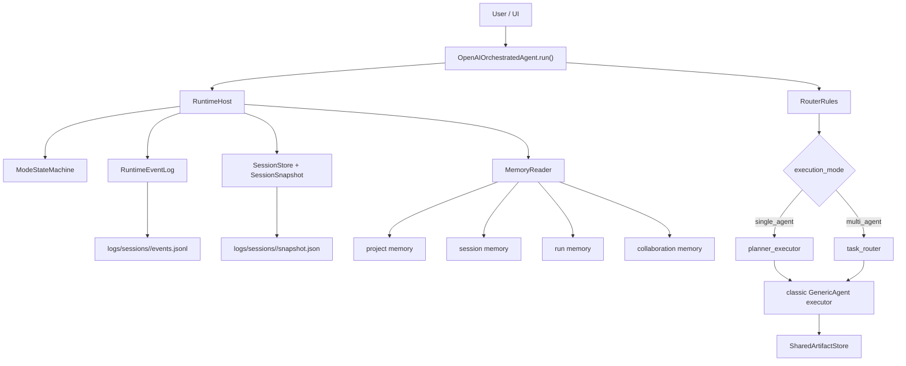

# Runtime Final Result

## What Is Implemented

This runtime pass makes the current GenericAgent behave like a real local coding runtime instead of a loose orchestration script.

Implemented now:

- One shared entrypoint with explicit `single_agent` and `multi_agent` routing.
- Persistent session snapshots for stop, restore, and memory read-side use.
- A runtime host that owns mode changes, event logging, review finalization, stop, restore, and failure capture.
- A runtime event log written to `logs/sessions/<session_id>/events.jsonl`.
- A mode state machine with legal transitions for `idle`, `direct_answer`, `plan`, `code`, `diagnose`, `review`, `recovery`, `stopped`, `completed`, and `failed`.
- Review-gated session completion in the OpenAI orchestrated path.
- Recovery-mode restore from persisted session snapshot.
- Memory planes split into:
  `project memory`,
  `session memory`,
  `run memory`,
  and `collaboration memory`.

## What Now Happens In A Real Run

1. User request enters the shared orchestrated runtime entrypoint.
2. Router decides `target`, `mode`, and optional `parallel_subtasks`.
3. `RuntimeHost` creates a session, primary task, first events, and snapshot.
4. Route application sets the runtime mode.
5. The run executes in `single_agent` or `multi_agent` mode.
6. LLM turns, tool calls, handoffs, review, stop, and failures are recorded into the event log.
7. Snapshots are rewritten during execution so the runtime can stop and restore with evidence.
8. Successful completion now passes through review events before the session is marked completed.

## Files That Matter Most

- `core/openai_agentmain.py`
  Real execution-loop wiring.
- `core/router_rules.py`
  Shared entrypoint route contract.
- `core/runtime/host.py`
  Runtime control plane.
- `core/runtime/state_machine.py`
  Mode rules.
- `core/runtime/event_log.py`
  Event persistence.
- `core/context/session_store.py`
  Snapshot persistence.
- `core/context/memory_reader.py`
  Memory-plane read-side and session snapshot reads.

## Architecture

## Event Chain Now Present

- `session_started`
- `user_message_received`
- `mode_changed`
- `llm_call_started`
- `llm_call_completed`
- `tool_requested`
- `tool_allowed`
- `tool_started`
- `tool_completed`
- `tool_failed`
- `diff_generated`
- `diff_applied`
- `review_started`
- `review_completed`
- `stop_requested`
- `session_stopped`
- `session_restored`
- `session_completed`
- `session_failed`
- `handoff_requested`
- `handoff_completed`

## Test Status

Verified under `rag-env`:

- `tests/unit/test_runtime_state_machine.py`
- `tests/unit/test_runtime_host.py`
- `tests/unit/test_session_store.py`
- `tests/unit/test_memory_reader.py`
- `tests/unit/test_agent_graph.py`
- `tests/unit/test_dynamic_graph.py`
- `tests/unit/test_router_rules.py`
- `tests/architecture/test_context_boundaries.py`
- `tests/unit/test_executor_backend_sync.py`
- `tests/unit/test_agent_comparison.py`
- `tests/unit/test_tool_permissions.py`

Current executed result: `168 passed`.

## Remaining Gaps

The runtime is now real, but three hardening layers are still future work:

- Tool policy is not yet a full registry-plus-gate system for every tool.
- Diagnose mode is not yet backed by a dedicated diagnosis engine and structured evidence reports.
- Worktree isolation is not yet wired for high-risk edits.

Those are no longer architecture blockers. They can now be added on top of a live session, event, mode, and snapshot backbone.
