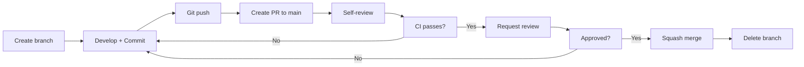
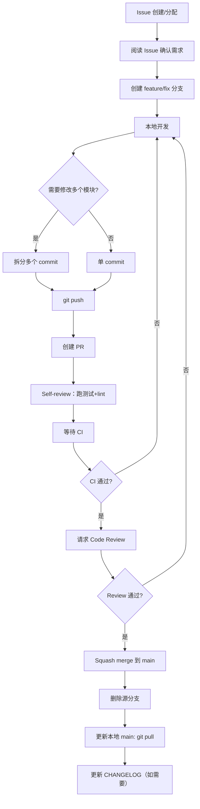

# GenericAgent Workbench — 工作流程规范

> 版本: 1.0 | 生效日期: 2026-05-01
> 适用范围: GenericAgent Workbench 项目所有开发者

---

## 一、Git 工作流规范

### 1.1 分支策略

采用 **Trunk-Based Development + Feature Branches** 轻量模式。

```
main (稳定版本)
├── feat/*          # 功能分支（如 feat/runtime-profiler）
├── fix/*           # 修复分支（如 fix/tool-schema-loading）
├── refactor/*      # 重构分支（如 refactor/split-agentmain）
├── docs/*          # 文档分支（如 docs/contributing-guide）
├── test/*          # 测试分支（如 test/core-coverage）
└── chore/*         # 杂项分支（如 chore/env-migration）
```

#### 分支命名规则

```
<type>/<short-description>

type 必选，短横线分隔小写英文
- feat: 新功能
- fix: 缺陷修复
- refactor: 重构（不新增功能也不修 bug）
- docs: 文档变更
- test: 测试相关
- chore: 构建/配置/工具链变更

示例:
  feat/openai-agent-router     ✅
  fix/file-read-encoding       ✅
  refactor/split-agentmain     ✅
  my-branch                     ❌ (缺少 type 前缀)
  codex/test-prev-version       ❌ (非标准命名)
```

#### 禁止的分支操作

- ❌ 禁止直接向 `main` push（仅允许 PR 合并）
- ❌ 禁止 `main` 上直接开发
- ❌ 禁止长期存在的 feature 分支（超过 1 周未合并）

### 1.2 Commit 规范

遵循 [Conventional Commits](https://www.conventionalcommits.org/) 规范。

```
<type>(<scope>): <description>

[optional body]

[optional footer]
```

#### Type 定义

| Type | 含义 | 版本影响 | 示例 |
|------|------|----------|------|
| `feat` | 新功能 | 次版本+1 | `feat(runtime): add file read shortcut` |
| `fix` | 缺陷修复 | 修订号+1 | `fix(ga): handle empty tool result` |
| `refactor` | 重构 | 无 | `refactor(agent): split agent_loop dispatch` |
| `docs` | 文档 | 无 | `docs: add CONTRIBUTING.md` |
| `test` | 测试 | 无 | `test(core): add profiler unit tests` |
| `chore` | 杂项 | 无 | `chore: update ruff config` |
| `style` | 格式 | 无 | `style: fix indentation in ga.py` |
| `perf` | 性能 | 无 | `perf(llmcore): cache tool schema` |

#### Scope 定义

| Scope | 对应模块 |
|-------|----------|
| `agent` | agentmain.py, agent_loop.py |
| `ga` | ga.py (GenericAgentHandler) |
| `llmcore` | llmcore.py |
| `runtime` | core/runtime/ |
| `memory` | core/memory/, memory/ |
| `skills` | core/skills/ |
| `tools` | core/tools/ |
| `quality` | core/quality/ |
| `frontend` | frontends/ |
| `docs` | docs/ |
| `config` | pyproject.toml, ruff.toml, .gitignore |

#### 提交示例

```bash
# 合格
git commit -m "feat(runtime): add tool result truncation for long outputs"
git commit -m "fix(ga): handle UnicodeDecodeError in file_read"
git commit -m "refactor(agent): extract tool dispatch to BaseHandler"
git commit -m "docs: add ADR for dual-backend architecture"
git commit -m "test(core): add unit tests for RuntimeProfiler"
git commit -m "chore: add pre-commit config for ruff"

# 不合格
git commit -m "fix bug"                     # 缺少 scope 和详细描述
git commit -m "update"                       # 无 type
git commit -m "wip"                          # 同上
git commit -m "fix some issues"              # 描述模糊
```

#### 提交粒度原则

- **每个 commit 只做一件事** — 不要混合 feat + fix + refactor
- **小而频繁** — 宁可 10 个小型 commit，不要 1 个巨型 commit
- **保持可构建** — 每个 commit 都应让项目处于可运行状态

### 1.3 PR 流程



#### PR 模板

```markdown
## 描述
[简要描述改动内容和动机]

## 关联 Issue
Closes #N

## 变更类型
- [ ] feat（新功能）
- [ ] fix（缺陷修复）
- [ ] refactor（重构）
- [ ] docs（文档）
- [ ] test（测试）
- [ ] chore（配置/工具链）

## 测试
- [ ] 新增单元测试覆盖
- [ ] 现有测试全部通过
- [ ] 手动验证（描述验证步骤）

## 检查清单
- [ ] 代码符合 ruff 规范（ruff check 无新增警告）
- [ ] 已更新相关文档
- [ ] 已添加 CHANGELOG 条目
- [ ] 无 API key/密码硬编码
- [ ] 无 debug print 残留
```

#### 合并策略

- **默认使用 Squash merge** — 将 feature 分支的多个 commit 压缩为 1 个
- 禁止 `--no-ff` 保留全部 commit 历史（分支已删除，commit 历史无意义）
- 合并后立即删除源分支

---

## 二、代码规范

### 2.1 Python 版本

- 目标版本: Python 3.10+
- 已配置: `ruff.toml` 中 `target-version = "py310"`
- 禁止使用 3.11+ 独占特性（如 `Self` type, `StrEnum`）

### 2.2 ruff 配置（现有 + 补充）

当前配置（`ruff.toml`）:
```toml
target-version = "py310"
line-length = 120

[lint]
select = ["E", "F", "I", "W", "UP", "B"]

[format]
quote-style = "double"
indent-style = "space"
```

**补充建议**（在现有基础上追加）:
```toml
[lint]
# 追加：
extend-safe-fixes = [
    "UP008",   # 替换 super() 调用
    "UP032",   # 使用 f-string
]

# 可考虑追加：
# "N"    # 命名规范（PEP8）
# "SIM"  # 简化表达式
# "RUF"  # ruff 专用规则

[per-file-ignores]
"tests/*" = ["B018", "S101"]  # 测试文件允许 assert/空表达式
"scripts/*" = ["B018"]
```

### 2.3 类型注解规范

#### 必须标注类型注解的场景

```python
# ✅ 函数签名（参数 + 返回值）
def file_read(path: str, start: int = 1, count: int = 200) -> str: ...

# ✅ 类属性
class GeneraticAgent:
    llmclients: list[ToolClient]
    lock: threading.Lock
    history: list[dict]

# ✅ 全局变量
PROJECT_ROOT: str = os.path.abspath(...)
```

#### 允许省略类型注解的场景

```python
# ❌ 局部变量（类型可推导）
items = parse_json(raw)  # 类型可推导，无需标注

# ❌ 单行 lambda
f = lambda x: x.strip()
```

#### TypeVar / Protocol 使用

```python
from typing import TypeVar, Protocol

T = TypeVar('T', bound='BaseTool')

class ToolClient(Protocol):
    def execute(self, tool_name: str, args: dict) -> str: ...
```

### 2.4 Docstring 规范

使用 **Google Style** docstring。

```python
def file_read(path: str, *, start: int = 1, count: int = 200) -> str:
    """Read file content with line number display.

    Args:
        path: File path, relative or absolute.
        start: Starting line number (1-based). Defaults to 1.
        count: Number of lines to read. Defaults to 200.

    Returns:
        File content with line number prefix if show_linenos=True,
        otherwise raw content.

    Raises:
        FileNotFoundError: If the specified file does not exist.
        PermissionError: If read permission is denied.
    """
```

#### 必须写 docstring 的场景

- 所有 **public 函数/方法**
- 所有 **class 定义**
- 所有 **模块**（文件顶部）

#### 允许省略 docstring 的场景

- private 函数（`_` 前缀）
- 明显的 getter/setter/property
- 测试函数（用 test 函数名自文档）

---

## 三、测试规范

### 3.1 测试框架

- **框架**: pytest（必须使用，禁止 unittest）
- **断言**: 原生 assert（禁止 `self.assertEqual`）
- **Mock**: `unittest.mock`（或 `pytest-mock`）
- **覆盖率**: `pytest-cov`

### 3.2 目录结构

```
tests/
├── conftest.py           # 全局 fixture（mock LLM 客户端、临时目录等）
├── unit/                 # 单元测试
│   ├── test_llmcore.py
│   ├── test_agent_loop.py
│   ├── test_ga.py
│   ├── test_runtime/
│   │   ├── test_profiler.py
│   │   └── test_shortcut.py
│   └── test_tools/
│       └── test_schema_selector.py
├── integration/          # 集成测试
│   ├── test_agent_flow.py
│   └── test_frontend_health.py
└── fixtures/             # 测试数据
    ├── sample_tool_schema.json
    └── sample_memory.txt
```

### 3.3 命名约定

- **文件**: `test_<module>.py`
- **类**: `Test<Feature>`（可选）
- **函数**: `test_<scenario>_<expected_behavior>`

```python
# ✅ 好
def test_file_read_with_invalid_path_returns_error(): ...
def test_tool_dispatch_with_unknown_tool_falls_back(): ...

# ❌ 差
def test_file_read(): ...        # 信息不足
def test_1(): ...                # 无意义
```

### 3.4 Mock 策略

```python
# 针对 LLM 调用的 mock — 避免真实网络请求
@pytest.fixture
def mock_llm_client(mocker):
    client = mocker.Mock()
    client.execute.return_value = "mocked response"
    return client

# 对文件系统的 mock — 使用 tmp_path fixture
def test_file_read_uses_correct_path(tmp_path):
    test_file = tmp_path / "test.txt"
    test_file.write_text("hello")
    result = file_read(str(test_file))
    assert "hello" in result
```

### 3.5 覆盖率目标

| 模块 | Phase 2 目标 | Phase 3 目标 |
|------|-------------|-------------|
| core/ga.py | ≥ 70% | ≥ 85% |
| core/agent_loop.py | ≥ 70% | ≥ 85% |
| core/llmcore.py | ≥ 50% | ≥ 75% |
| core/runtime/ | ≥ 60% | ≥ 80% |
| core/tools/ | ≥ 60% | ≥ 80% |
| core/memory/ | ≥ 50% | ≥ 75% |
| core/skills/ | ≥ 30% | ≥ 60% |
| core/quality/ | ≥ 30% | ≥ 60% |
| **全项目** | **≥ 60%** | **≥ 80%** |

### 3.6 CI 触发规则

```yaml
# .github/workflows/ci.yml
on:
  push:
    branches: [main, feat/*, fix/*, refactor/*]
    paths-ignore: ['docs/**', '**.md']  # 纯文档变更不触发
  pull_request:
    branches: [main]

jobs:
  lint:
    runs-on: windows-latest
    steps:
      - run: ruff check core/ --output-format=github

  test:
    needs: lint
    runs-on: windows-latest
    steps:
      - run: pip install -r requirements.txt
      - run: pip install pytest pytest-cov
      - run: pytest tests/ --cov=core/ --cov-fail-under=60
```

---

## 四、文档规范

### 4.1 模块 README 要求

每个模块目录（`core/` 下的子目录）必须包含 `README.md`：

```markdown
# <Module Name>

## 职责
[该模块的核心职责，一句话说清]

## 结构
[文件清单及各自职责的简要说明]

## 依赖
- [内部依赖] core/xxx
- [外部依赖] requests, openai

## 使用示例
```python
from core.runtime import RuntimeProfiler
profiler = RuntimeProfiler()
with profiler.span("task"):
    do_work()
```

## 维护者
[负责人或团队]
```

### 4.2 API 文档

- 使用 docstring 自动生成（建议 Sphinx + autodoc）
- 每个 public function 必须有 docstring（Google Style）
- API 文档存放在 `docs/api/`

### 4.3 架构决策记录 (ADR)

**何时需要写 ADR**：
- 引入新的外部依赖
- 新增/修改核心架构设计
- 选择技术方案（如某库 vs 某库）
- 重大 API 变更

**ADR 模板**（放在 `docs/adr/`）：

```markdown
# ADR-NNN: <标题>

## 状态
[提议 | 接受 | 废弃 | 替代]

## 上下文
[为什么要做这个决策？背景和动机]

## 决策
[选择了什么方案？具体内容]

## 备选方案
[考虑了哪些方案？为什么没选？]

## 后果
[采纳后带来的正面/负面影响]

## 日期
YYYY-MM-DD
```

**ADR 索引**（`docs/adr/README.md`）：
```markdown
# Architecture Decision Records

| # | 标题 | 状态 | 日期 |
|---|------|------|------|
| 001 | 双后端架构 | 接受 | 2026-04-15 |
| 002 | 结构化记忆系统 | 接受 | 2026-04-20 |
| 003 | 工具架构精简方案 | 接受 | 2026-04-25 |
```

---

## 五、发布流程

### 5.1 版本号规范

遵循 [Semantic Versioning 2.0](https://semver.org/)。

```
MAJOR.MINOR.PATCH
   ↑      ↑     ↑
   │      │     └── 修订号：向下兼容的 bug 修复
   │      └──────── 次版本号：向下兼容的新功能
   └─────────────── 主版本号：不兼容的 API 变更
```

- **开发阶段**: `0.x.y`（主版本 0 表示不稳定）
- **首次稳定**: `1.0.0`
- **预发布**: `1.0.0-alpha.1`, `1.0.0-beta.1`, `1.0.0-rc.1`

### 5.2 tag 策略

```bash
# 创建版本 tag
git tag -a v0.1.0 -m "v0.1.0: Initial structured memory implementation"

# 推送 tag
git push origin v0.1.0

# tag 命名规则
v<major>.<minor>.<patch>[-<pre-release>.<N>]

# 示例
v0.1.0
v0.2.0-alpha.1
v1.0.0-rc.1
v1.0.0
v1.0.1
```

### 5.3 Changelog 维护

文件：`CHANGELOG.md`，格式遵循 [Keep a Changelog](https://keepachangelog.com/)。

```markdown
# Changelog

## [Unreleased]

### Added
- 新功能 A

### Fixed
- Bug fix B

## [0.1.0] - 2026-05-01

### Added
- Classic executor 主循环
- OpenAI Agents 路由层
- File read shortcut 加速

### Security
- 修复 API key 明文存储问题

---

[Unreleased]: https://github.com/org/repo/compare/v0.1.0...HEAD
[0.1.0]: https://github.com/org/repo/releases/tag/v0.1.0
```

#### Changelog 变更触发规则

- `feat` commit → 追加到 `### Added`
- `fix` commit → 追加到 `### Fixed`
- `docs` commit → 追加到 `### Changed`（文档相关）
- `refactor` commit → 通常不记录（除非重大重构）
- `chore` commit → 通常不记录

### 5.4 发布 checklist

```markdown
## 发布 checklist

- [ ] CHANGELOG.md 已更新到最新版本
- [ ] 版本号已在 pyproject.toml 中更新
- [ ] 所有测试通过（pytest --cov）
- [ ] 静态检查通过（ruff check core/）
- [ ] 创建版本 tag（git tag -a vX.Y.Z）
- [ ] 发布说明已撰写（GitHub Release 或类似）
- [ ] 文档已同步更新
- [ ] 依赖版本已锁定（pip freeze > requirements.lock）
```

---

## 六、安全检查清单

### 每次提交前检查

```markdown
## 安全检查清单

### 密钥管理
- [ ] 代码中无 API key / 密码 / token 硬编码
- [ ] .env 文件不在版本控制中（检查 .gitignore）
- [ ] 测试中不使用真实 API key

### 路径安全
- [ ] 文件路径使用 os.path.join，不是字符串拼接
- [ ] 用户输入路径已校验（无路径穿越风险）
- [ ] temp/ 数据不提交到仓库

### 代码安全
- [ ] 无 subprocess 调用 shell=True（如果必须，参数已转义）
- [ ] eval/exec 仅在受控环境使用（工具函数中的代码执行除外）
- [ ] debug print/console.log 已清理

### 依赖安全
- [ ] 新增依赖已记录到 requirements.txt
- [ ] 依赖版本已锁定（不写宽松版本如 openai>=1.0）
- [ ] 不引入已知有 CVE 的旧版本依赖
```

---

## 七、日常开发工作流

### 从 Issue 到合并的完整链路



### 每日开发流程

```bash
# 1. 开始新一天
git checkout main
git pull
git checkout -b feat/my-feature

# 2. 开发中 — 小步提交
git add core/runtime/profiler.py
git commit -m "feat(runtime): add span timing for profiler"

# 3. 同步主分支（避免大冲突）
git fetch origin
git rebase origin/main   # 用 rebase 不是 merge

# 4. 提交前检查
ruff check core/
pytest tests/

# 5. 推送并创建 PR
git push -u origin feat/my-feature
# 在 GitHub/GitLab 上创建 PR

# 6. 合并后清理
git checkout main
git pull
git branch -d feat/my-feature
```

### 分支同步策略

```bash
# 推荐：rebase（保持线性历史）
git fetch origin
git rebase origin/main

# 传统：merge（保留合并节点）
git fetch origin
git merge origin/main

# ⚠️ 项目决定：统一使用 rebase 策略
# 原因：保持 commit 历史线性清晰，便于回溯
```

### 冲突处理

```bash
# 当 rebase 产生冲突时
git rebase origin/main
# 解决冲突后
git add <resolved-files>
git rebase --continue
# 如果无法解决，可以中止
git rebase --abort
```

---

## 八、快速参考卡片

### 常用命令速查

```bash
# 代码检查
ruff check core/                    # lint 检查
ruff check core/ --fix              # 自动修复
ruff format core/ --check           # 格式检查

# 测试
pytest tests/ -v                    # 运行所有测试
pytest tests/unit/ -k "profiler"   # 按关键字筛选
pytest --cov=core/ --cov-report=html  # 覆盖率报告

# Git
git commit --allow-empty -m "chore: trigger CI"  # 空提交触发 CI
git log --oneline --graph           # 查看提交图
git shortlog -sn                    # 查看贡献统计

# 版本
pip freeze > requirements.lock      # 锁定依赖版本
```

### 文件模板索引

| 文件 | 用途 | 位置 |
|------|------|------|
| PR 模板 | Pull Request 描述 | `.github/PULL_REQUEST_TEMPLATE.md` |
| Issue 模板 | Issue 创建 | `.github/ISSUE_TEMPLATE/` |
| Commit 规范速查 | 本地开发 | 本文 `1.2` 节 |
| ADR 模板 | 架构决策 | 本文 `4.3` 节 |
| 发布 checklist | 版本发布 | 本文 `5.4` 节 |

---

> 本规范文件本身受版本控制。修改需通过 PR 流程，并在 CHANGELOG.md 中记录。